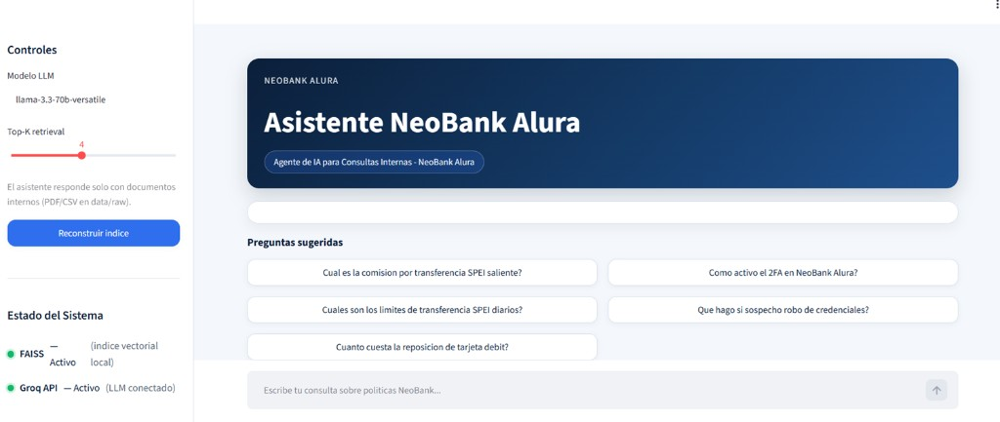

# Challenge Alura Agent — NeoBank Alura (RAG Fintech)

Asistente conversacional con **RAG local** para consultar politicas, tarifas y seguridad de un banco digital ficticio (**NeoBank Alura**).

Caso de uso: un cliente o agente de soporte pregunta en lenguaje natural ("¿Cuánto cuesta un SPEI?", "¿Cómo activo 2FA?") y el sistema responde **solo** con información de documentos internos (PDF/CSV), citando la fuente.

> Repositorio: https://github.com/FelipeOctavio87/Challenge_AluraAgent

---

## Arquitectura

```text
data/raw (PDF + CSV)
        |
        v
   ingest.py  -->  FAISS (vectorstore/)
        |
        v
  rag_chain.py  <--  LLM API (Groq / OpenAI compatible)
        |
        v
     app.py (Streamlit :8501)
```

| Capa | Tecnologia |
|------|------------|
| UI | Streamlit |
| Orquestacion | LangChain |
| Embeddings | `sentence-transformers/all-MiniLM-L6-v2` (local) |
| Vector store | FAISS |
| LLM | API OpenAI-compatible (default: Groq) |
| Deploy | Docker en OCI Compute |

---

## Estructura del repositorio

```text
Challenge_AluraAgent/
├── app.py                 # Interfaz Streamlit
├── requirements.txt
├── Dockerfile
├── docker-compose.yml
├── .env.example
├── data/raw/              # PDF + CSV Fintech
├── scripts/generate_docs.py
├── src/
│   ├── config.py
│   ├── ingest.py
│   ├── prompts.py
│   └── rag_chain.py
├── vectorstore/           # Indice FAISS (generado)
└── docs/
    ├── deploy_oci.md
    ├── ejemplos_qa.md
    └── screenshots/
```

---

## Requisitos previos

- **Python 3.12** (recomendado; 3.11+ en Linux/OCI)
- API key de un LLM compatible OpenAI (ej. [Groq](https://console.groq.com/))
- (Opcional) Docker para contenedor / deploy OCI

---

## Ejecucion local

```bash
# 1) Entorno
py -3.12 -m venv venv
# Windows:
venv\Scripts\activate
# Linux/macOS:
# source venv/bin/activate

pip install -r requirements.txt

# 2) Variables de entorno
copy .env.example .env   # Windows
# cp .env.example .env   # Linux/macOS
# Edita .env y pon LLM_API_KEY=...

# 3) Generar documentos (si data/raw esta vacio)
python scripts/generate_docs.py

# 4) Construir indice FAISS
python -m src.ingest

# 5) Levantar UI
streamlit run app.py
```

Abre http://localhost:8501

### Preguntas sugeridas

- ¿Cuál es la comisión por transferencia SPEI saliente?
- ¿Cómo activo el 2FA en NeoBank Alura?
- ¿Cuáles son los límites de transferencia SPEI diarios?
- ¿Qué hago si sospecho robo de credenciales?
- ¿Cuánto cuesta la reposición de tarjeta débit?

Mas ejemplos en [`docs/ejemplos_qa.md`](docs/ejemplos_qa.md).

---

## Docker (local)

```bash
cp .env.example .env   # configura LLM_API_KEY
docker compose up -d --build
```

App en http://localhost:8501

---

## Deploy en OCI

Guia paso a paso (crear instancia Ubuntu 22.04, Security List puerto **8501**, script SSH):  
[`docs/deploy_oci.md`](docs/deploy_oci.md)

Script listo para pegar en la VM: [`scripts/deploy_oci.sh`](scripts/deploy_oci.sh)

```bash
ssh -i ~/.ssh/id_rsa ubuntu@<IP_PUBLICA>
export GROQ_KEY="gsk_..."
bash -c 'git clone https://github.com/FelipeOctavio87/Challenge_AluraAgent.git && cd Challenge_AluraAgent && bash scripts/deploy_oci.sh'
```

### Enlace en vivo

| Ambiente | URL |
|----------|-----|
| Local | http://localhost:8501 |
| OCI Compute | http://\<IP_PUBLICA_OCI\>:8501 |

> Tras el deploy, sustituye `\<IP_PUBLICA_OCI\>` por la IP publica de la instancia (ej. `http://132.145.12.34:8501`) y marca el checklist de abajo.

---

## Capturas / demos

Coloca las imagenes en `docs/screenshots/` y enlazalas asi:

```markdown



```

Ejemplos de Q&A esperados: [`docs/ejemplos_qa.md`](docs/ejemplos_qa.md).

---

## Configuracion LLM

Variables en `.env` (ver `.env.example`):

| Variable | Ejemplo |
|----------|---------|
| `LLM_API_KEY` | tu clave |
| `LLM_BASE_URL` | `https://api.groq.com/openai/v1` |
| `LLM_MODEL` | `llama-3.3-70b-versatile` |

Tambien funciona con OpenAI (`https://api.openai.com/v1`) u otros endpoints compatibles.

---

## Challenge Alura — checklist de entrega

- [x] Documentos Fintech PDF/CSV
- [x] Pipeline RAG (loader, chunking, FAISS, retrieval chain)
- [x] Interfaz Streamlit
- [x] Empaquetado Docker + guia OCI + script `scripts/deploy_oci.sh`
- [ ] IP publica OCI documentada en la tabla **Enlace en vivo** (tras deploy real)
- [ ] Capturas en `docs/screenshots/` enlazadas arriba
